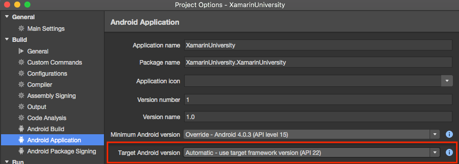
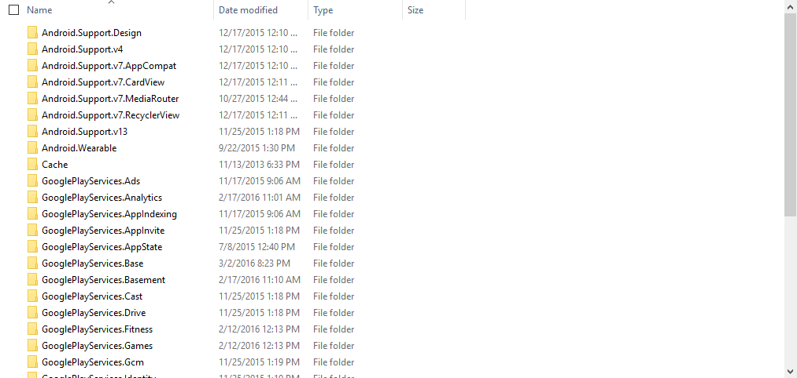

# Troubleshooting

## Setup on a Mac
Generally, iOS development goes very smoothly. The most common issues encountered are: Missing Android SDK versions and
Android emulator issues.

If the *Android* application fails to build on either environment, then
verify you have the proper Android SDK versions installed. You will
often get an error that reads something like **"The required Android SDK
x.xx is missing…"**. To correct this, install the proper runtime
versions using the manager (**Tools \> Open Android SDK Manager…**).

Alternatively, you can open the Android project (right-click on the
project in the solution pad and choose **Options**) and change the
**Minimum Android Version** to an SDK version you have installed.



If you have trouble connecting or launching the emulator from Xamarin Studio, try launching the Android emulator *before* you run your program and then *keep it running*. If Xamarin Studio fails to detect the emulator, then close the IDE and restart it. It should detect the running emulator on launch and then the emulator will show up in the available choices in the toolbar.

## Common Build Problems

When you have trouble with a specific class, make sure to check the FAQ link available on the [Classes Page](https://university.xamarin.com/classes).

Also, make sure you are on the *stable* update channel, and that you have applied any released updates or fixes to your development environment, both from Xamarin and Microsoft if you are using Visual Studio.

---
**Android project fails to build and gives an error indicating a file failed to unzip, a zip file is invalid, or an error similar to "Please install package: 'Android Support Library' available in SDK installer."**

Android projects utilize a suite of support libraries from Google - these provide backwards compatibility, additional SDK features, and bindings to the native APIs exposed in the OS. The managed wrappers are all installed through NuGet, but the _native_ libraries are not. These native libraries are downloaded by the IDE from a Google server (m2repository) as zip files and are then unzipped and used for each of your Xamarin.Android projects that include the support libraries or Google Play. 

Sometimes, the download will fail or be interrupted and the IDE will get confused and give build errors. To correct this, you can delete the zip folder and all of the unzipped libraries. The next build will re-download all the required files. This will add time to that first build - but it will correct these sorts of problems.

On Windows, the cache is located at `%USERPROFILE%\AppData\Local\Xamarin`, on macOS it's in `/Users/[Username]/.local/share/Xamarin/`. There will be a folder for each Android support library:



Inside these folders will be each version that has been downloaded. Delete each of these folders (or just the ones reporting errors) and the **zips** folder which contains the originally downloaded file. **DO NOT DELETE THE Mono for Android folder**.

Then rebuild your project - this should kick off an MSBuild task to re-download the zip and extract the library for the Android version your app is targeting.

---
***Android application builds but fails to deploy to the device/emulator, or I get a DWP Handshake failed from the Visual Studio Android Emulator***

Try turning off "Use Fast Deployment" in the project settings for the Xamarin.Android application. This is on the **Android Options** tab of the project settings. 

---
***Cannot set a project as active in a lab solution***

If you find that the **Set As Active Project** option is not available, or that the IDE is not listing the expected simulators/emulators in the devices drop-down, this often occurs because the build setting is incorrect. In particular, projects created with Visual Studio have different [build configurations](https://msdn.microsoft.com/en-us/library/kkz9kefa.aspx) for the different iOS settings - Simulator vs. Device vs. Adhoc deployment. When this build environment is not set correctly, the IDE will often restrict what you can set as active and what can be run in the debugger.

---
***The common-code Portable Class Library (PCL) is not being built and/or deployed with my platform-specific project***

This is often an indication that the solution configuration is not correct. The solution tracks the dependencies between projects and ensures that it builds those dependencies in the correct order. Sometimes, particular with Xamarin.Forms, the solution configuration can be missing a dependency which causes the shared code to not be built and deployed properly. You can fix this by editing the [solution configuration](https://msdn.microsoft.com/en-us/library/bb166577.aspx) in either Visual Studio, or Xamarin Studio through the solution options (right-click on the solution, **Options > Build > Configurations**).

---
***I'm getting a compile-time error in Visual Studio about NuGet packages being missing and needing to be restored, but it looks like they are there!***

This is very likely due to an invalid `Target` tag in the **.csproj** file that is added by Visual Studio and ignored by Xamarin Studio. If you update the required NuGet packages in Xamarin Studio, it leaves these old tags in place and causes this type of error.

To fix it, edit the **.csproj** of the project which is reporting the error in a text editor and locate the tags which have the error message. They will look something like this:

```
<Target Name="EnsureNuGetPackageBuildImports" BeforeTargets="PrepareForBuild">
    <PropertyGroup>
      <ErrorText>This project references NuGet package(s) that are missing on this computer. Enable NuGet Package Restore to download them.  For more information, see http://go.microsoft.com/fwlink/?LinkID=322105. The missing file is {0}.</ErrorText>
    </PropertyGroup>
    <Error Condition="!Exists('..\..\packages\Xamarin.Forms.1.3.1.6296\build\portable-win+net45+wp80+MonoAndroid10+MonoTouch10+Xamarin.iOS10\Xamarin.Forms.targets')" Text="$([System.String]::Format('$(ErrorText)', '..\..\packages\Xamarin.Forms.1.3.1.6296\build\portable-win+net45+wp80+MonoAndroid10+MonoTouch10+Xamarin.iOS10\Xamarin.Forms.targets'))" />
  </Target>
```

You can either update the package it is looking for, or just remove the entire `Target` tag altogether - it's a prompt to restore the missing package and not required to actually build the project. Once you've edited the file, save it and reload it in Visual Studio and you should be able to build the project.

---
***Problems with the Xamarin.iOS Build Host***

See this helpful documentation page on [iOS build host troubleshooting](http://developer.xamarin.com/guides/ios/getting_started/installation/windows/troubleshooting/)

---
***Application crashes immediately after deploying to Android Emulator.***

If you have multiple Android SDK versions installed, there is a rare chance that apps can be built in a way that will crash immediately after you start them. This appears to be related to deploying to an emulator running an SDK version older than the latest you have installed. If you encounter this error, as a quick fix, you can simply tell it to not use the latest SDK version to build.

To do this in Xamarin Studio, right-click your Android project and choose **Tools \> Edit File**. This will open the file to see the raw XML.

In Visual Studio, right-click your Android project and choose Unload Project. After it is unloaded, you can right-click and choose "Edit YourProject.csproj" to see the raw XML.

Once you are editing the project XML, find the `AndroidUseLatestPlatformSdk` property and set it to `False` to fix the issue.

```
<AndroidUseLatestPlatformSdk>False</AndroidUseLatestPlatformSdk>
```

Save the changes to your project file. Xamarin Studio will automatically load the changes. In Visual Studio, right-click the unloaded project and choose "Reload Project".

